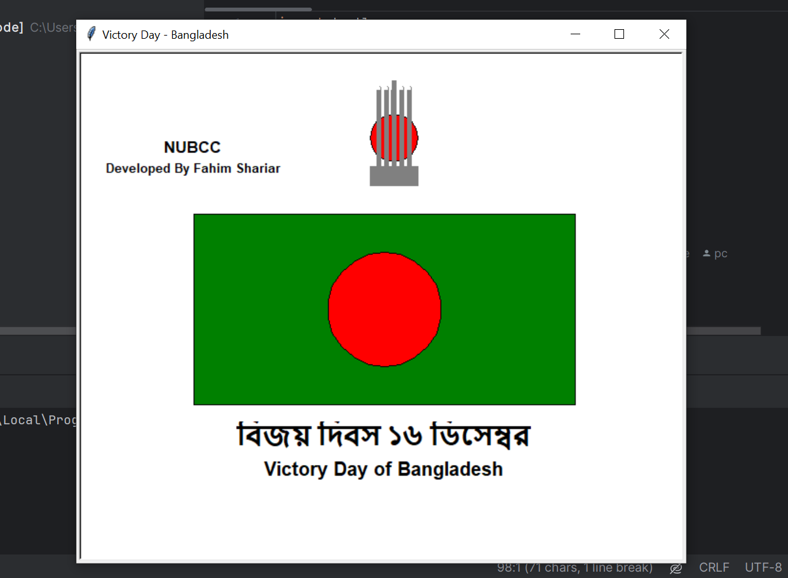

### Description  
This project is a **Python Turtle Graphics** representation of Bangladesh's Victory Day (১৬ ডিসেম্বর), featuring the National Flag and Shohid Minar. The artwork includes both the red sun symbolizing victory and the iconic Shohid Minar, symbolizing the sacrifices of the martyrs.  

---

### Features  
- **Bangladesh National Flag**: Green rectangle with a centered red circle.  
- **Shohid Minar**: Realistic depiction outside and above the flag.  
- **Text Annotations**: Includes "Victory Day of Bangladesh" in both **Bengali** and **English**.  
- **Custom Branding**: "NUBCC" and "Developed By Fahim Sharia" added for personalization.  

---

### Preview  
Here is a preview of the final output:  

  

---

### How to Run  
1. Install **Python 3.x** on your system if not already installed.  
2. Copy the code into a Python file (e.g., `main.py`).  
3. Run the script using the following command:  
   ```bash
   python main.py
